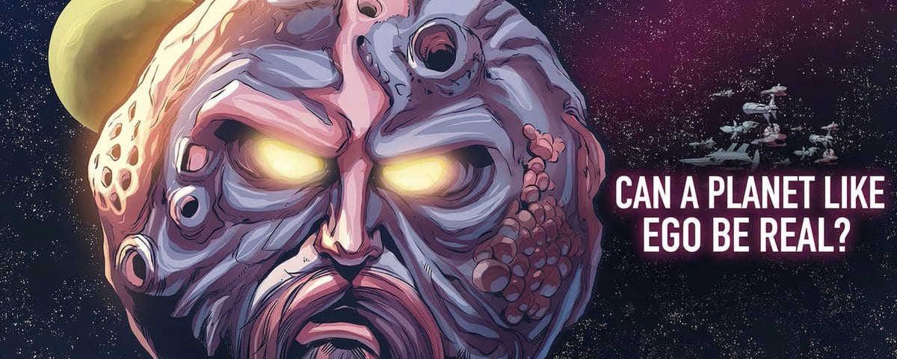
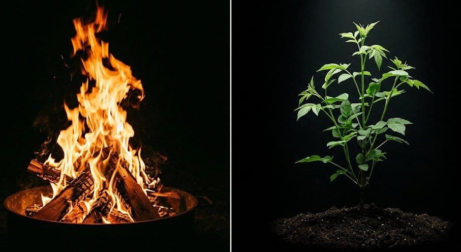
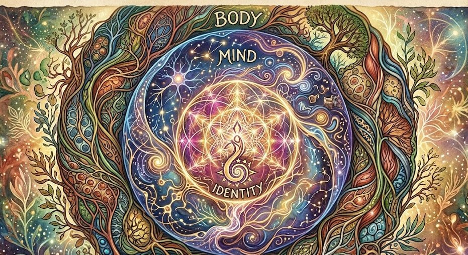
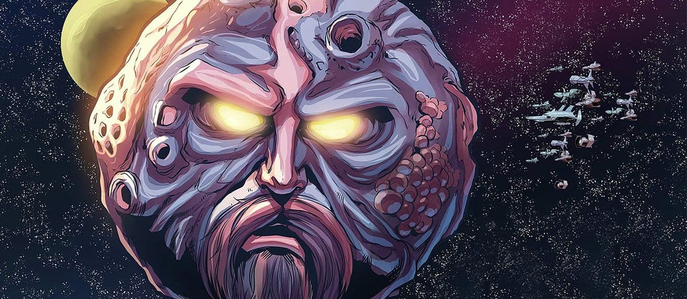

## The map you were handed is broken

Ask anyone what "life" is and they'll recite some version of the same list: it eats, metabolises, excretes, breathes, moves, grows, reproduces, and responds to stimuli. This is the standard biological definition, and it has one catastrophic flaw: it is a description of life forms we already recognise, dressed up as a universal law.

It's like defining "music" as "sound produced by stringed instruments." Technically describes a lot of music. Excludes everything interesting.

A mule cannot reproduce. A virus cannot metabolise on its own. Fire eats, grows, responds to stimuli, and reproduces, yet we don't call it alive. A 3D-printed coral reef satisfies almost none of the criteria, yet the ecosystem it hosts is vividly, urgently alive. The definition keeps breaking down at the edges, and we keep patching it, never asking whether the whole framework is wrong.

Fire eats, grows, spreads, and dies. Our definition of life was never equipped to explain why it doesn't count.

<aside class="pullquote">We have been defining life by its costume, not its character.</aside>

## Conway's grid and the accident that changed everything

In 1970, mathematician John Conway sat down and invented a game with no players. He called it the Game of Life, and it was possibly the most important thing ever created on graph paper.

<figure class="article-media">
  <video src="../../media/alive/game-of-life.mp4" autoplay muted loop playsinline></video>
  <figcaption>Conway's Game of Life. Patterns that move, replicate, and build emerge from four simple rules. No biology required.</figcaption>
</figure>

The premise is absurdly simple. A grid of cells, each either alive or dead. Each cell's next state is determined by exactly four rules based on how many neighbours are alive. That's it. No randomness. No hidden variables. Pure, deterministic mathematics.

What emerges is staggering. Stable structures. Oscillating patterns. "Gliders" that move across the grid. Structures that replicate themselves. Structures that build other structures. Given a large enough grid, the Game of Life can simulate any computation — including, hypothetically, the computation that produces you.

Conway's Game of Life proves that life-like complexity, growth, reproduction, and self-organisation can emerge from a system with zero biological components. The rules don't know about DNA. They don't know about cells. They only know about neighbours. And yet, given scale, they produce something indistinguishable from life.

This is not a metaphor. This is a mathematical proof. Complexity, organisation, and even reproduction are not properties that require biology. They are properties that emerge from structured interaction at scale.

## A new definition: life as emergent structured growth

Here is the replacement framework. Life is not a checklist of biological functions. Life is an emergent property of interacting systems that exhibit structured, self-sustaining growth.

What does "structured growth" mean? It means growth that follows internal logic that builds on itself, that creates order rather than chaos, that generates complexity from simplicity. A crystal grows, but its growth is purely additive. Life, under this definition, is specifically the kind of growth that creates feedback loops — where the growing thing shapes the conditions for its own continued growth.

*Three forms of life, nested. You contain multitudes, and two of them can die while one keeps breathing.*

Under this lens, here is what actually qualifies:

**Layer 1: the biological body.** Cells interacting, organs organising, systems maintaining homeostasis. Classic life, now properly understood as emergent — not magic, not a checklist, but complexity arising from chemistry.

**Layer 2: the mind.** Neurons firing in patterns. Ideas forming, growing when pondered, reproducing when shared. Your thoughts are structured configurations of neural activity that exhibit every property of life under this framework.

**Layer 3: identity and culture.** The patterns of interaction between humans — languages, religions, nations, subcultures. They grow, compete, adapt, go extinct. A culture is a living thing as surely as a forest.

You are not one living thing. You are at least three, nested inside each other, each with its own growth agenda, each capable of being sustained or extinguished independently of the others.

> A brain-dead person is a biological life persisting after the death of a mind. We have no word for that because we never thought we needed one.

## Ideas are alive, and this changes everything about speech

If the mind is a living system, then ideas are its organisms. An idea forms as a structured neural configuration — a specific pattern of connectivity in roughly 86 billion neurons. When you develop an idea, you are growing it. When you share it, you are reproducing it into another mind. When it spreads through a culture, it is colonising new territory, competing with other ideas for cognitive real estate.

This isn't poetic licence. Evolutionary biologist Richard Dawkins noticed the same thing in 1976, coining the term "meme" for exactly this reason: a unit of cultural information that replicates, mutates, and competes for survival. But Dawkins stopped short of the full implication. If ideas are life forms, then constraining speech isn't just a political act. It is a biological act. It is the suppression of reproduction.

Freedom of expression, under this framework, is not merely a civil liberty. It is a life right — the right of a cognitive organism to reproduce.

The entropy angle: life, under every framework, is essentially a local reversal of entropy, a pocket of increasing order in a universe trending toward disorder. What makes biological life remarkable is that it uses energy to build and maintain complex structures against the thermodynamic tide. So does a mind developing a new theory. So does a civilisation constructing law and literature. The physics doesn't change just because the substrate isn't carbon.

## The planet that's alive, and it's not science fiction

Now for the idea that should genuinely unsettle you.

Early life on Earth faced a world of scarcity. Usable carbon just 0.02% of the Earth's crust. Nitrogen locked in atmospheric N₂, almost entirely inaccessible. Water abundant, yes, but the building blocks of complex life were rare and unevenly distributed. In this environment, the winning strategy is obvious: make copies. If resources are scarce and patchy, spread yourself across as much territory as possible. One copy might find the nitrogen. Another might find the carbon. Reproduction is essentially a bet-hedging strategy against a hostile, resource-limited world.

But now ask a different question. What if those resources were not scarce? What if carbon, nitrogen, and the necessary chemistry were distributed uniformly and abundantly across an entire planet's surface?

In that world, reproduction becomes counterproductive. Making copies means creating competitors for resources you already have. The optimal strategy flips entirely: grow larger, not more numerous. Invest in complexity and size rather than replication. One organism, expanding to fill the available space, consuming and incorporating everything around it.

<aside class="pullquote">On a planet of perfect abundance, the entire planet becomes one organism. It has no reason to divide.</aside>

This is not a thought experiment about alien life. It is a lens for understanding Earth. Lovelock and Margulis proposed the Gaia Hypothesis in the 1970s — the idea that Earth's biosphere functions as a single self-regulating system, maintaining conditions for life much as a body maintains homeostasis. They were ridiculed for decades. Under the framework we've built here, they were simply recognising a larger scale of the same emergent phenomenon.

Earth's atmosphere has maintained breathable oxygen concentrations, stable temperatures, and balanced chemistry for billions of years — not by accident, but through the collective regulatory action of life itself. The biosphere inhales CO₂ and exhales oxygen. It sequesters carbon. It recycles nitrogen. It is doing exactly what a living system does: using energy to maintain ordered structure against entropy.

The question is not whether the planet is alive. The question is whether we have been too small-minded to recognise it.

## Who are you, really?

This framework hands you a new answer to the oldest question in philosophy.

You are not your body. You are not your mind. You are not your identity. You are the temporary intersection of three distinct emergent life forms that happen to be co-located in space and time. Your body wants food, safety, and reproduction. Your mind wants stimulation, growth, and the propagation of its ideas. Your identity wants recognition, belonging, and legacy.

Most human conflict — internal and external — is these three agendas pulling against each other. The monk who starves the body to feed the mind. The artist who destroys relationships in pursuit of a legacy. The addict, whose body's chemistry has overridden the mind's stated preferences. We call these struggles moral failures, or psychological pathologies. Perhaps they are ecological crises: one life form cannibalising another within the same host.

The observer problem: here is one final fracture in the conventional definition — it requires an observer. We call things "alive" or "dead" based on our scale of perception and our inherited categories. But emergence doesn't care about observers. The Game of Life's gliders don't know they're alive. Earth's biosphere doesn't know it's self-regulating. You, at the scale of your constituent atoms, look nothing like a living thing. Life, it turns out, is always something that happens between scales — never visible at the level you're looking.

### So what now?

Drop the checklist. Start asking the right question — not "does this thing eat, breathe, and reproduce?" but "does this system exhibit structured, self-sustaining growth that maintains order against entropy?"

Ask it about your company. Ask it about your city. Ask it about the internet. Ask it about the ideas currently colonising your mind. Ask it about the planet you live on.

You will find life everywhere. You were just looking at too small a scale.

*First published on [X](https://x.com/tejasktwt/status/2042569299022524761), 10 April 2026.*
