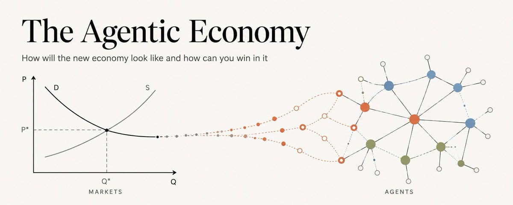
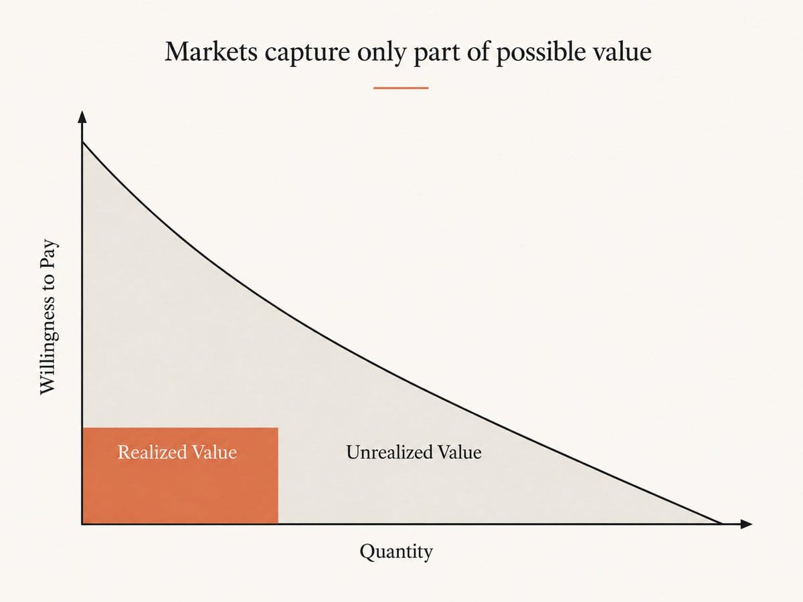
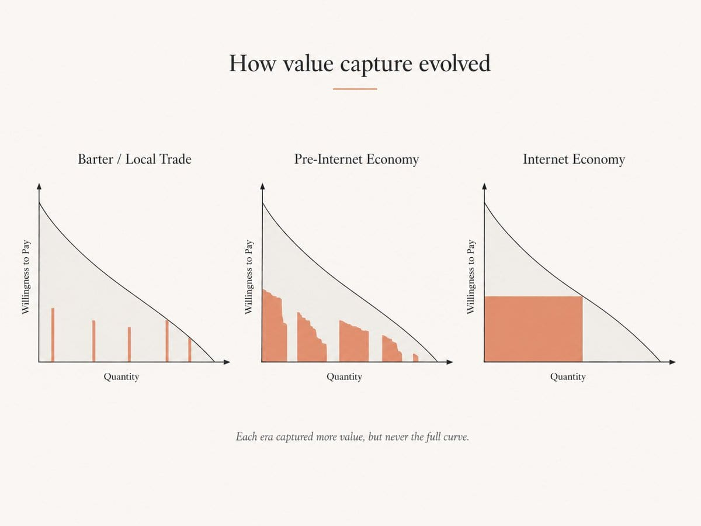
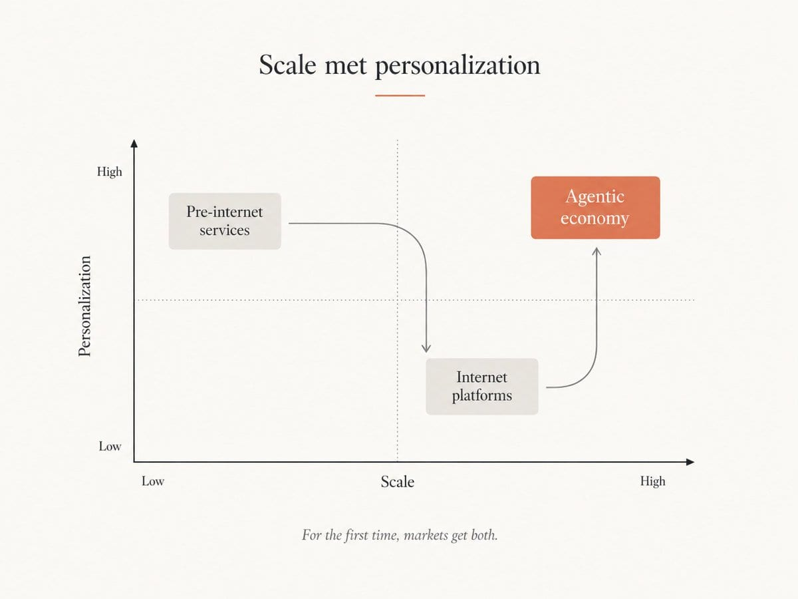
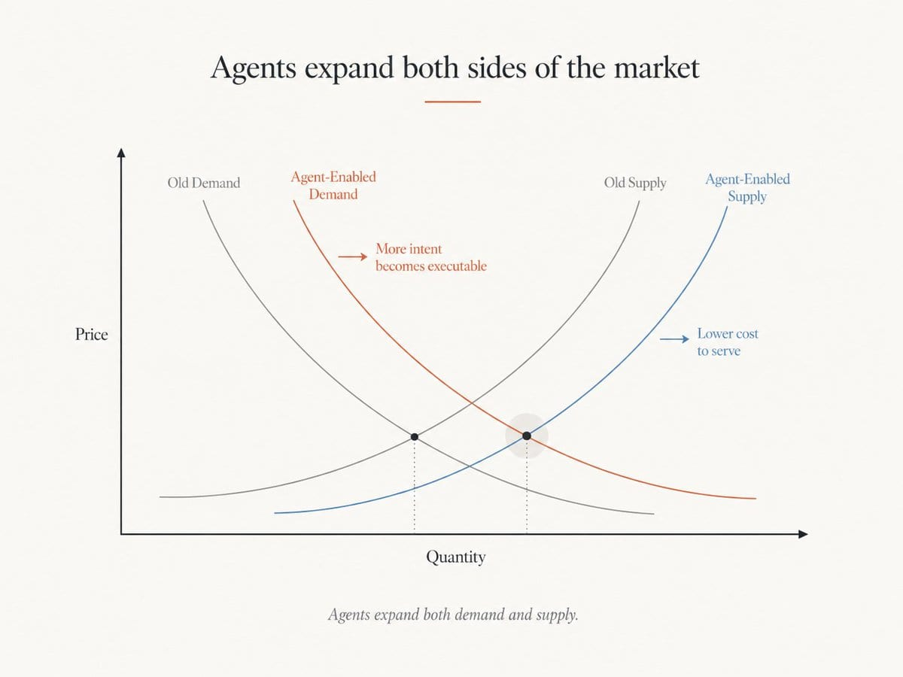
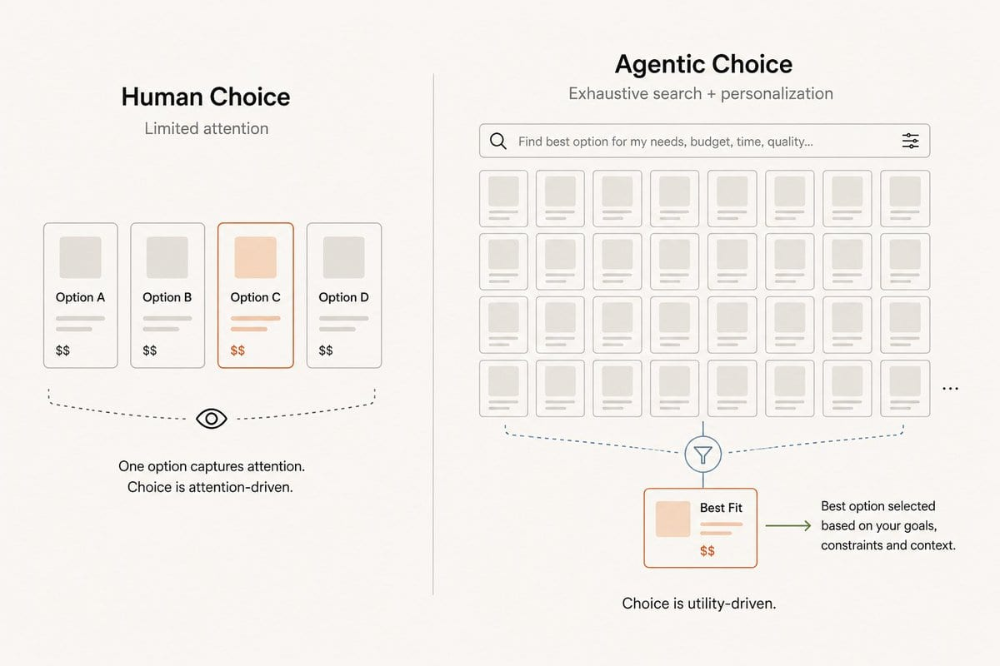
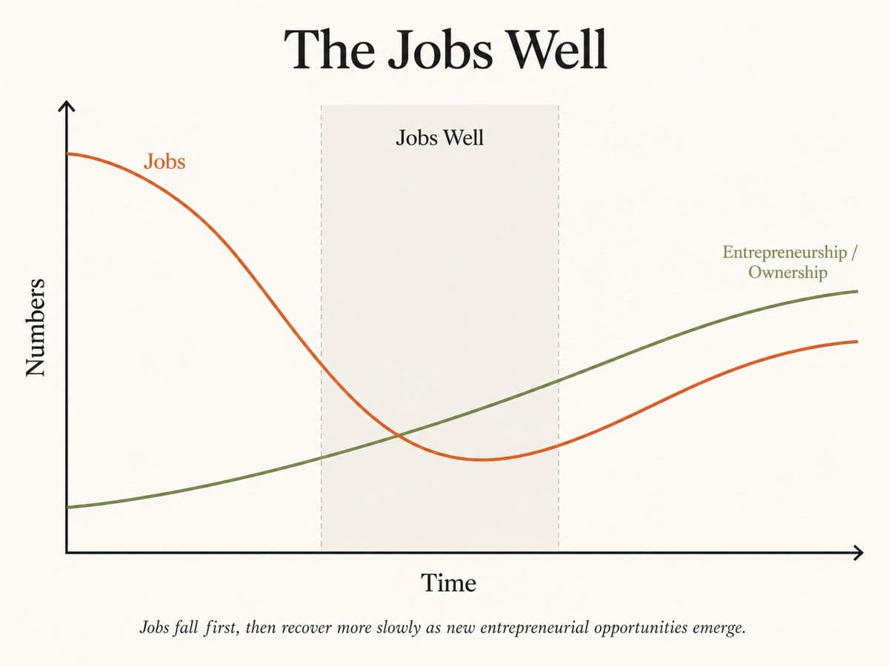

## AI is a bubble

Look at every AI company's demos and the keynotes. What has AI actually changed, at scale, in daily economic life? Drafts come faster. Summaries are cheaper. Code gets autocompleted.

Useful. Modestly profitable. Worth a few billion, maybe.

Not worth the largest capital bet in human history.

Trillions of dollars do not make sense for a faster inbox.

Or maybe we are just missing the point.

## The real prize: more of the curve becomes real

Think of the demand curve as a map of how much different people would pay for the same thing. One person might pay $100, another $50, another $10. Add all of those possible buyer values together, and you get the area under the curve. That is the total value the market could create if every willing buyer could make the right deal.

But in the real world, many of those deals never happen. The buyer may never find the seller. The price may be wrong. The effort may be too high for a small purchase. So a lot of potential value stays unrealized.

Economic progress is mostly about fixing that. Better markets make it easier for more of those possible deals to actually happen. That is how more of the curve becomes real.

## How each era captured more value

Barter had a brutal constraint: the double coincidence of wants. I might have grain and want shoes, while the shoemaker wants milk, not grain. Value existed, but trade failed.

> Money did not create value, it made value exchangeable.

Pre-industrial markets were local and discontinuous, so the economy captured only scattered strips of value under the curve.

Then industrialization changed the supply side. Factories made output continuous, standardized, and abundant. Once supply became smoother, economies needed larger markets to absorb it, and that pressure drove long-distance trade, transshipment, and the age of discovery. Industrialization smoothened supply first; global trade worked to smoothen demand.

The internet pushed this much further, making discovery, distribution, and market access global. But it also imposed a new limit: static public pricing. A website can reach everyone and still show the same offer to everyone, so the internet captured far more value than older markets, mostly as a large rectangle created by fixed prices at scale, not as the full area under the curve.

Pre-internet services had the opposite property: personalization without scale. The internet gave us scale without real personalization.

## Agents do what the internet could not

For centuries, markets had to choose between personalization without scale and scale without personalization. Agentic AI is the first system that can combine both.

Agents search, compare, negotiate, personalize, and execute on behalf of users, collapsing the frictions that block mutually beneficial trades:

- search costs
- comparison costs
- negotiation costs
- execution delays
- attention limits
- repeated context sharing

<aside class="pullquote">The internet scaled access. Agents scale market clearing.</aside>

The internet helped buyers find sellers; agents help buyers and sellers clear. A business agent can tailor an offer to a buyer’s budget, urgency, constraints, and preferences without human overhead each time. A user agent can scan thousands of options, hold context, and negotiate for the best fit. What once required either a local shopkeeper or a static webpage can now happen dynamically, at scale, in real time.

That pushes markets closer to the full area under the curve, because each transaction can be matched more precisely to the person on the other side.

## Why agents expand the market itself

Agents do not just cut costs, they make far more transactions possible.

On the demand side, humans procrastinate. They delay purchases they already want because the process is too long, too confusing, or too cognitively expensive. Humans are also attention-constrained. A person can see, compare, and reason through only a few options before fatigue sets in, which is why the human economy becomes an attention economy and the option that captures attention often wins the market.

Agents weaken that bottleneck. They can search more exhaustively, compare more options, hold more context, and evaluate choices against the user’s actual constraints instead of whatever grabbed attention first. Demand rises because more willingness-to-pay becomes executable, and because choice becomes less attention-driven and more utility-driven.

This unlock is so large that businesses should share part of it with users. If agents make customers faster, better informed, and more likely to convert, businesses should not merely tolerate agentic buying behavior — in many cases they should subsidize it.

On the supply side, businesses can produce more efficiently, sell more effectively, and support more customers at lower cost, which expands output and draws in more suppliers. Even microtransactions that were uneconomical for humans become viable once agents can evaluate and execute them cheaply.

## The jobs well

This shift will also hit the job market.

The four classic factors of production are land, capital, labor, and entrepreneurship. AI does not simply erase jobs, it shifts value creation away from labor and toward entrepreneurship, ownership, and orchestration. If one person working with agents can do what once required many people, fewer people will be needed in the same role.

That creates a real fear: if labor demand falls, does the consumer economy collapse?

Not necessarily. If agentic AI expands both demand and supply, the economy itself can grow much larger, but the composition of income will change, and more people will need to move from pure labor toward ownership, orchestration, and entrepreneurship.

The problem is elasticity. Labor markets are highly elastic on the downside — companies can cut jobs fast. Entrepreneurship is far less elastic on the upside — new companies, products, and markets take time to form. That creates a temporary well in the wages market, a painful gap where jobs disappear faster than entrepreneurial capacity can emerge.

> AI does not remove the need for humans to earn, it changes where earning comes from.

## How to win in the agentic economy

The winners will not just use AI to cut costs, they will build for agentic demand.

That means building businesses that are easy for agents to discover, compare, trust, negotiate with, and transact with. It means turning products into clear outcomes, making pricing programmable, exposing capabilities through clean interfaces, and stripping friction from the path between intent and fulfillment.

For founders, this is a chance to build with smaller teams and larger leverage. For incumbents, it is a warning: if your business depends on human attention but is hard for agents to evaluate or buy from, you will lose distribution.

There is also a model-layer opportunity here. Most frontier models were shaped by RLHF for safe, compliant human interaction, which made sense for chatbots. Then RL environments unlocked agentic computer use. Real economic agents will need more: they must operate in adversarial settings, negotiate strategically, reason through incentives, and play repeated games in the real world.

That opens a frontier for RL companies. The next wave of capability is training agents for negotiation, strategy, robustness, and economic action. The companies that build that capacity early may end up powering the operating layer of the agentic economy.

For VCs, AI companies, and policymakers, the biggest prize is not just better models, it is building a faster bridge from displaced labor to new ownership and entrepreneurship.

> Whoever helps society cross this well fastest will shape the next economy.

*First published on [X](https://x.com/tejasktwt/status/2052726938184392851), 8 May 2026.*
